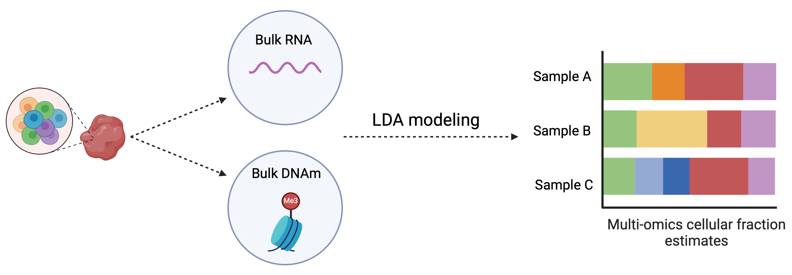

# EMixed

<!-- badges: start -->
<!-- badges: end -->

EMixed, a cellular deconvolution method designed for multi-omics deconvolution. It can also be used in single omics deconvolution (RNA or DNAm data)

## Installation

You can install the development version of EMixed like so:

``` r
# devtools::install_github("manqicai/EMixed")
```
## Workflow



## Tutorial

https://manqicai.github.io/EMixed/

